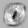
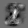
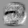
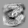
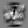
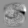
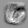
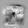
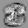
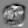

13.8.

Tällä viikolla en ehtinyt tekemään projektia kuin yhtenä päivänä, mutta sain implementoitua backpropagationin! Toki implementaatio ei varmasti ole täydellinen, mutta se toimii: sain mahdllisimman yksinkertaisella kymmenen neuronin ja vain yhden kerroksen kokeilulla osumaprosentiksi 87.87! Tässä mallissakin on vielä paljon puutteita, se ei mm. muuta neuronien biasta (vakiotermi), enkä kouluttanut sitä kuin yhden koulutusdatan iteraation verran. Tein myös toiminnallisuuden jolla eri neuronien painot pystyy visualisoimaan, sillä ajattelin että yhden kerroksen kymmenen neuronin mallissa eri neuroninen painot varmaankin myötäilisivät niiden vastuulla olevan numeron ääriviivoja. Visualisointi ei siis oikein edes toimi muille kuin input-kerrokselle, sillä vain siinä jokainen paino vastaa suoraan yhtä pikseliä.

Ensi viikolla kokeilen useamman kerroksen malleja, mutta uskon että törmään niissä suorituskykyhaasteisiin ja matriisien implentoinnin tarpeeseen.

Tässä ovat eri numeroita tunnistavien neuronien painot kuvaamastani karvalakkimallista visualisoituna, tummempi pikseli tarkoittaa negatiivista painoa kyseiselle pikselille ja vaalea positiivista painoa:

### Nolla

### Yksi

### Kaksi

### Kolme

### Neljä

### Viisi

### Kuusi

### Seitsemän

### Kahdeksan

### Yhdeksän

Tällä viikolla käytin aikaa projektiin n. 6 tuntia
